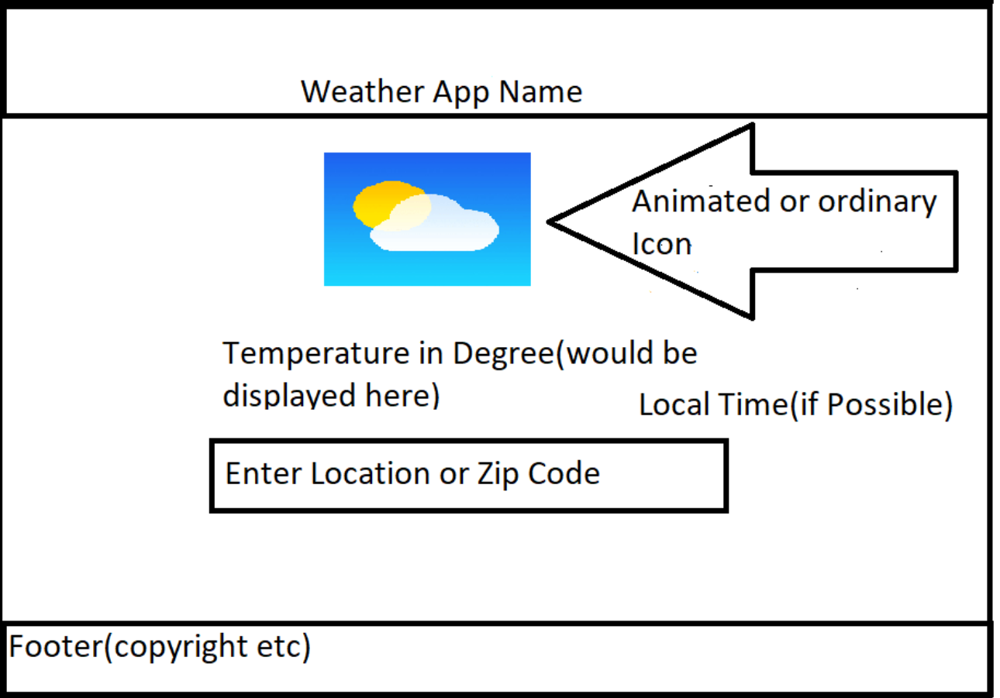

# REDI Sprint 2020 Frontend Development 2, Final Project

Application Name: Weather App

Student Name: Vidhya Krishnan

## {app-name}

Weather app which accepts user information in the form of placenames and displays the weather of the respective place

## Screenshots

## Features:

- 5 day Weather Forecast
- Background Image that changes according to the user information
- Animated Icon or icon that changes according to weather
 - current time and Date is displayed
